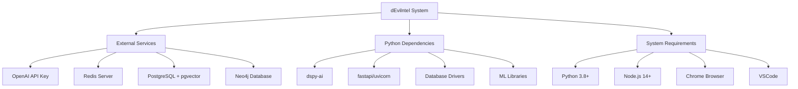

# dEvilntel Runnability Assessment & Next Steps

## Runnability Assessment: **Medium-Low (60%)**

This document outlines the findings from the initial codebase analysis and provides a set of actionable next steps to make the dEvilntel project runnable.

### ✅ **Strengths**

1.  **Comprehensive Documentation**: The [`devintel-setup-guide.md`](../documentation/devintel-setup-guide.md) provides detailed setup instructions with clear prerequisites.
2.  **Well-Structured Architecture**: Clear separation of concerns with Chrome extension, VSCode extension, backend server, and dashboard components.
3.  **Modern Tech Stack**: Uses contemporary technologies (FastAPI, WebSockets, DSPy, etc.).
4.  **Automated Setup**: The [`setup.sh`](../setup.sh) script attempts to automate the installation process.

### ⚠️ **Critical Issues**

1.  **Missing `requirements.txt`**: The [`setup.sh`](../setup.sh) script references `pip install -r requirements.txt`, but this file doesn't exist in the repository. The dependencies are listed in [`devintel-setup.json`](../documentation/devintel-setup.json).
2.  **Missing `server.py`**: The setup script tries to run `python server.py`, but this file is missing. There's a [`devintel-realtime-server.py`](../documentation/devintel-realtime-server.py) in the documentation folder.
3.  **File Location Discrepancy**: The setup assumes files are in the root directory, but actual implementation files are in the `documentation/` folder.
4.  **Platform Dependency**: The [`setup.sh`](../setup.sh) uses Homebrew, making it macOS-specific without alternatives for other platforms.

### 🔧 **Dependencies & Infrastructure Requirements**



---

## 📋 **Actionable Next Steps**

The following steps must be taken to make the project runnable.

### 1. Create `requirements.txt`
Create a `requirements.txt` file in the root directory with the following content from [`documentation/devintel-setup.json`](../documentation/devintel-setup.json):
```txt
dspy-ai
fastapi
uvicorn
redis[hiredis]
asyncpg
neo4j
numpy
sentence-transformers
pgvector
pydantic
```

### 2. Reorganize Project Structure
Move and rename the core Python files from the `documentation/` directory to the root directory to match the expectations of the setup scripts.

-   Move `documentation/devintel-realtime-server.py` to `server.py`
-   Move `documentation/devintel-system.py` to `devintel.py`

### 3. Update `setup.sh`
Modify the [`setup.sh`](../setup.sh) script to be more robust:
-   Add a check for the operating system and provide instructions for non-macOS users.
-   Include a step to prompt for and set the `OPENAI_API_KEY` environment variable.
-   Ensure the script has the correct permissions to execute (`chmod +x setup.sh`).

### 4. Resolve Python Imports
After moving the files, verify that the Python imports within `server.py` and `devintel.py` are resolved correctly. The `from devintel import ...` statement in `server.py` should now work as expected.

### 5. Extract Browser Extension Files
The files for the Chrome extension are currently embedded within [`documentation/devintel-setup.json`](../documentation/devintel-setup.json). They need to be extracted into a `browser-extension/` directory as per the setup guide.

### 6. Address VSCode Extension
The setup guide mentions a VSCode extension, but the files are not present. These files need to be created or located to have a fully functional system.

---

### 🎯 **Estimated Time to Completion**

-   **For an experienced developer**: 2-3 hours (fixing file locations, dependencies, configuration)
-   **For a novice**: 4-6 hours (learning about databases, troubleshooting)

### 📊 **Component Readiness**

| Component | Status | Issues |
|-----------|--------|---------|
| **Backend Server** | 🟡 Partial | Missing proper file structure, imports need fixing |
| **Chrome Extension** | 🟢 Ready | Files present in JSON config, needs extraction |
| **VSCode Extension** | 🔴 Missing | Referenced but files not visible |
| **Database Setup** | 🟡 Partial | Scripts present but platform-specific |
| **Documentation** | 🟢 Excellent | Comprehensive and detailed |