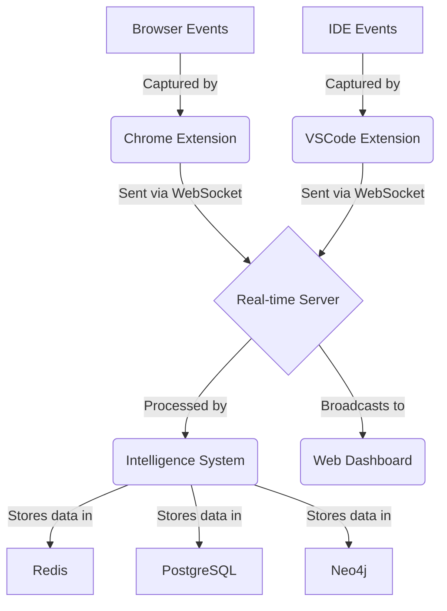

# dEvilntel Cartography Report

## 1. Executive Summary

This report provides a comprehensive overview of the dEvilntel prototype project. The project is a development intelligence system designed to capture, analyze, and provide solutions for development-time events such as console logs, errors, and network requests. It consists of a Chrome Extension for capturing browser events, a VSCode Extension for tracking file changes and other IDE events, a real-time backend server for processing and storing events, and a web dashboard for visualizing the collected data.

The project's "North Star" is to become an irreplaceable, multi-modal, and autonomous development assistant that actively contributes to the development process through pull requests and improvement sprints, all while supporting the user and their data.

## 2. Component Inventory

The project is composed of the following main components:

| Component | Language/Framework | Files | Responsibilities |
| --- | --- | --- | --- |
| **Chrome Extension** | JavaScript | `devintel-enhanced.js` | Injects content script into web pages, captures browser events, and sends them to the backend server. |
| **Real-time Server** | Python, FastAPI | `devintel-realtime-server.py` | Provides a WebSocket and REST API for clients, manages client connections, and processes incoming events. |
| **Intelligence System** | Python, DSPy | `devintel-system.py` | Contains the core logic for data modeling, storage, and the AI-powered analysis of development events. |
| **Web Dashboard** | HTML, CSS, JavaScript | `prototype-devintel-dashboard.html` | A single-page application for visualizing the collected data in real-time. |
| **Setup & Configuration** | Markdown, JSON, Shell | `devintel-setup-guide.md`, `devintel-setup.json` | Provides the necessary instructions and configuration for setting up the project. |

## 3. Dependency Map

### External Dependencies

-   **Python 3.8+:** For the backend server and intelligence system.
-   **Node.js 14+:** For the VSCode extension.
-   **Chrome browser:** For the Chrome extension.
-   **VSCode:** For the VSCode extension.

### Python Dependencies

-   `dspy-ai`: For AI-powered error analysis.
-   `fastapi`: For the web server.
-   `uvicorn`: For running the web server.
-   `redis[hiredis]`: For the real-time streaming.
-   `asyncpg`: For the PostgreSQL connection.
-   `neo4j`: For the Neo4j connection.
-   `numpy`: For numerical operations.
-   `sentence-transformers`: For creating text embeddings.
-   `pgvector`: For vector similarity search in PostgreSQL.
-   `pydantic`: For data validation.

### JavaScript Dependencies

-   **Chart.js:** For creating charts in the web dashboard.
-   **Cytoscape.js:** For creating graphs in the web dashboard.

## 4. Data Flow Documentation

1.  **Event Capturing:** The Chrome Extension captures browser events (console logs, errors, network requests), and the VSCode Extension captures IDE events (file changes, etc.).
2.  **Event Transmission:** The extensions send the captured events to the Real-time Server via a WebSocket connection.
3.  **Event Processing:** The Real-time Server receives the events and passes them to the Intelligence System for processing.
4.  **Data Storage:** The Intelligence System stores the events in the appropriate databases:
    -   **Redis:** For real-time streaming.
    -   **PostgreSQL:** For long-term storage and vector similarity search.
    -   **Neo4j:** For storing relationships between events.
5.  **Data Visualization:** The Real-time Server broadcasts the processed data to the Web Dashboard, which visualizes it in real-time.

## 5. Integration Documentation

### APIs

-   **WebSocket API:** The primary API for real-time communication between the clients (Chrome Extension, VSCode Extension, Web Dashboard) and the server.
    -   **Endpoint:** `ws://localhost:8000/ws`
    -   **Monitoring Endpoint:** `ws://localhost:8000/ws/monitor`
-   **REST API:** A RESTful API for batch ingestion and other non-real-time operations.
    -   **Endpoints:** `/ingest`, `/patterns/{session_id}`, `/changelog/{session_id}`, `/outcome/{solution_id}`, `/dashboard`, `/sessions`

### External Service Connections

-   **OpenAI:** The Intelligence System uses the OpenAI API (via DSPy) to analyze errors and suggest solutions.

## 6. Quick Reference

-   **To start the system:** Follow the instructions in [`devintel-setup-guide.md`](./devintel-setup-guide.md.md).
-   **To understand the core logic:** See [`devintel-system.py`](./devintel-system.py.md).
-   **To understand the real-time server:** See [`devintel-realtime-server.py`](./devintel-realtime-server.py.md).
-   **To understand the Chrome Extension:** See [`devintel-enhanced.js`](./devintel-enhanced.js.md).
-   **To understand the web dashboard:** See [`prototype-devintel-dashboard.html`](./prototype-devintel-dashboard.html.md).